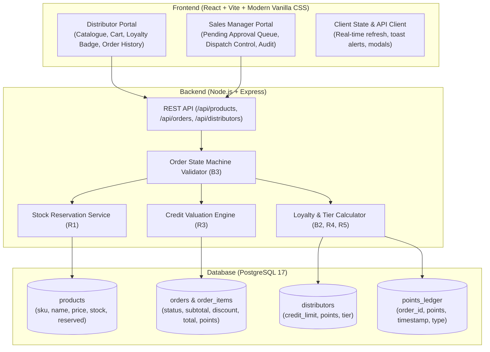
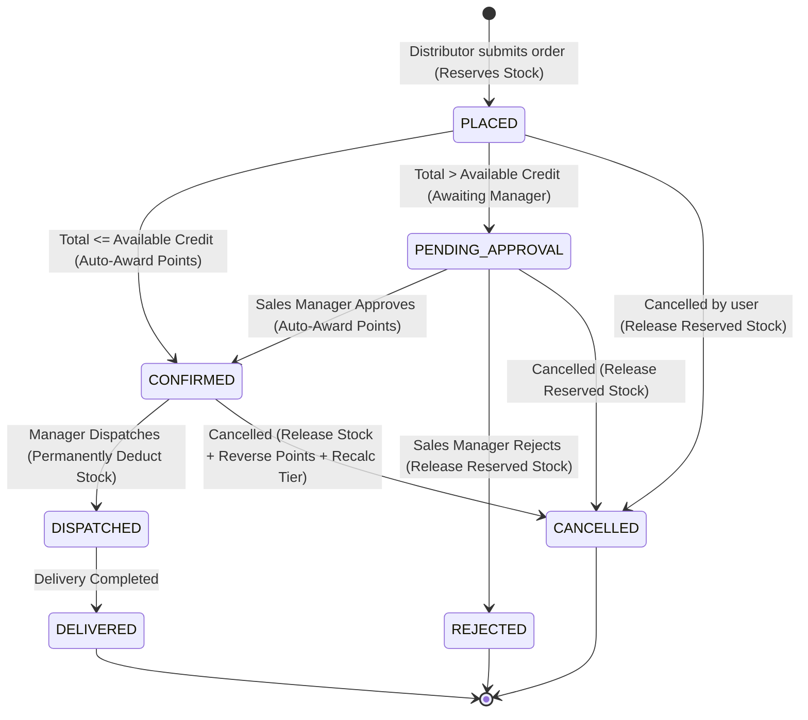

# Implementation Plan: Consumer Goods B2B Ordering, Stock Reservation & Loyalty System

Build a full-stack web application for a consumer goods manufacturer to take orders from distributors, track warehouse stock with strict reservations, and operate a dynamic points-based loyalty program.

---

## User Review Required

> [!IMPORTANT]
> **PostgreSQL Configuration**: The host system has PostgreSQL 17 running as a Windows service on port 5432. We have successfully verified database connectivity (`postgres` user, password configured). The backend will automatically create the database `metayb_db` (or use existing) and run migrations/seeds seamlessly.

> [!IMPORTANT]
> **Actor Roles Supported**:
> 1. **Distributor**: Browse product catalogue with live available stock (`stock_quantity - reserved_quantity`), view credit limit & available credit, see trailing 90-day loyalty points & tier discount (Bronze: 0%, Silver: 3%, Gold: 6%), build cart with multiple line items, place order, and track order history & status.
> 2. **Sales Manager**: Review pending orders where order total exceeded available credit, approve or reject them with real-time stock/credit impact, and dispatch confirmed orders to permanently deduct stock.
> 3. **System**: Automated transaction-safe credit checks, stock reservation (R1), loyalty point award upon reaching `confirmed` (R4), point reversal and tier recalculation upon cancellation (R5), and immutable locked discounts (R2).

---

## Architecture & Workflow Flowcharts

### 1. End-to-End System Architecture



### 2. Order State Transition Diagram (State Diagram v2)



### 3. Business Logic & Invariant Validation Flow

```mermaid
flowchart TD
    A[Order Request Received] --> B{Check Stock for each SKU:<br/>requested <= stock_quantity - reserved_quantity}
    B -- No --> C[Reject Order:<br/>Identify SKU & Available Quantity]
    B -- Yes --> D[Calculate Subtotal]
    D --> E[Fetch Distributor Current Tier:<br/>Bronze: 0%, Silver: 3%, Gold: 6%]
    E --> F[Apply Discount & Compute Total:<br/>Lock discount_rate on order]
    F --> G[Reserve Stock:<br/>reserved_quantity += requested]
    G --> H{Check Credit (R3):<br/>Available = CreditLimit - PendingExposures<br/>Is Total <= Available?}
    H -- Yes --> I[Status = CONFIRMED]
    I --> J[Award Points (R4):<br/>floor(Total / 100)<br/>Recalculate Tier (R5)]
    H -- No --> K[Status = PENDING_APPROVAL<br/>No Points Awarded]
    J --> L[Persist Transaction & Return Order]
    K --> L
```

---

## Core Business Rules Implementation Matrix

| Rule | Description | Implementation Strategy |
| :--- | :--- | :--- |
| **R1: Stock Reservation** | Stock reserved on `placed`. Permanently deducted on `dispatched`. Cancel/Reject before dispatch releases reservation exactly once. | `products` table maintains `stock_quantity` (on hand) and `reserved_quantity`. Available = `stock_quantity - reserved_quantity`. Stock checked atomically (`FOR UPDATE`). On dispatch: `stock_quantity -= qty`, `reserved_quantity -= qty`. On cancel/reject: `reserved_quantity -= qty`. |
| **R2: Fixed Discount** | Discount fixed at placement based on distributor's tier at that moment. | `orders` table stores `discount_rate`, `discount_amount`, `subtotal`, and `total_after_discount`. Once set at creation, future tier changes do not affect existing orders. |
| **R3: Credit Check** | `Available Credit = Credit Limit - Sum(total of orders NOT in ['delivered', 'cancelled', 'rejected'])`. | Executed in a PostgreSQL transaction. If `order.total <= available_credit` -> `confirmed`, else -> `pendingApproval`. |
| **R4: Points Award** | `points = floor(total_after_discount / 100)` awarded *only* upon reaching `confirmed`. | Points credited when transition to `confirmed` occurs (either at placement or on manager approval). A dedicated `points_ledger` records the credit. |
| **R5: Points Reversal & Recalculation** | Cancelling a `confirmed` order reverses awarded points. Tier recalculated after every points change. | Reversal entry added to ledger. Trailing 90-day active points summed up: `< 1000` = Bronze, `1000 - 4999` = Silver, `>= 5000` = Gold. Distributor tier updated immediately. |

---

## Proposed Changes

### Database & Seed Data (`backend/sql/`)

#### [NEW] `backend/sql/schema.sql`
- Complete DDL with primary keys, foreign keys, check constraints, default timestamps, and indexes:
  - `products` (`sku` PK, `name`, `unit_price`, `stock_quantity`, `reserved_quantity`, `created_at`)
  - `distributors` (`id` PK, `name`, `credit_limit`, `loyalty_tier`, `created_at`)
  - `sales_managers` (`id` PK, `name`, `email`)
  - `orders` (`id` PK, `distributor_id` FK, `status` enum check, `subtotal`, `discount_rate`, `discount_amount`, `total_after_discount`, `points_awarded`, `created_at`, `updated_at`)
  - `order_items` (`id` PK, `order_id` FK, `sku` FK, `quantity`, `unit_price`, `line_total`)
  - `loyalty_points_ledger` (`id` PK, `distributor_id` FK, `order_id` FK, `points_delta`, `reason`, `created_at`)

#### [NEW] `backend/sql/seed.sql`
- Seed data per B5:
  - **8 Products**:
    - `P-101`: Laundry Powder (Stock: 0 - OOS test)
    - `P-102`: Cereal Box (Stock: 1 - Edge stock test)
    - `P-100`: Premium Soap (Stock: 150)
    - `P-200`: Basmati Rice (Stock: 80)
    - `P-300`: Detergent Powder (Stock: 200)
    - `P-400`: Herbal Toothpaste (Stock: 300)
    - `P-500`: Sunflower Cooking Oil (Stock: 75)
    - `P-600`: Organic Shampoo (Stock: 120)
  - **3 Distributors**:
    - `D-BRONZE`: North Point Retail (Credit Limit: $5,000, 450 trailing points, Tier: Bronze)
    - `D-SILVER`: Metro Supply Co. (Credit Limit: $15,000, 2,400 trailing points, Tier: Silver)
    - `D-GOLD`: Prime Trade Hub (Credit Limit: $30,000, 6,800 trailing points, Tier: Gold)
  - **Historical Confirmed Orders**: Seeded within trailing 90 days with confirmed status to legitimize Silver and Gold tiers.
  - **1 Sales Manager**: `Ava Sterling` (`ava.manager@metayb.com`).

---

### Backend (`backend/`)

#### [NEW] `backend/package.json`
- Dependencies: `express`, `cors`, `dotenv`, `pg`.

#### [NEW] `backend/config/db.js`
- Connection pool with environment configuration, connection verification, and auto-database setup helper.

#### [NEW] `backend/services/orderService.js`
- Transactional workflows:
  - `placeOrder({ distributorId, items })`:
    - Validates product existence and stock availability (`stock - reserved >= requested`).
    - Locks rows with `SELECT ... FOR UPDATE`.
    - Computes subtotal, applies distributor's current loyalty tier discount (R2).
    - Reserves stock (`reserved_quantity += quantity`).
    - Calculates available credit (R3) = `credit_limit - sum(active orders total)`.
    - Determines initial status: `total <= available_credit ? 'confirmed' : 'pendingApproval'`.
    - If `confirmed`: awards points `floor(total / 100)` and recalculates tier.
  - `updateOrderStatus({ orderId, targetStatus, actorRole })`:
    - Enforces state machine transitions strictly.
    - If transitioning to `confirmed` (Manager approval): awards points and recalculates tier.
    - If transitioning to `dispatched`: permanently deducts stock (`stock -= qty, reserved -= qty`).
    - If transitioning to `rejected` or `cancelled`: releases reserved stock (`reserved -= qty`).
    - If cancelling a `confirmed` order: reverses awarded points in `loyalty_points_ledger` and recalculates distributor tier (R5).

#### [NEW] `backend/routes/api.js`
- Endpoints:
  - `GET /api/health`
  - `GET /api/products`: Catalogue listing SKU, name, unit price, stock on hand, reserved stock, and available stock.
  - `GET /api/distributors`: Details, credit limit, available credit, trailing points, current tier.
  - `GET /api/orders`: Order list with status, line items, discounts, totals.
  - `GET /api/orders/:id`: Order details.
  - `POST /api/orders`: Place new order.
  - `PATCH /api/orders/:id/status`: Transition order status (`confirmed`, `rejected`, `dispatched`, `delivered`, `cancelled`).
  - `POST /api/reset-seed`: Fast reset to seed state for interactive testing.

#### [NEW] `backend/server.js`
- Express bootstrap listening on port 5000.

---

### Frontend (`frontend/`)

#### [NEW] `frontend/package.json` & `frontend/vite.config.js`
- React 19 + Vite setup with proxy or direct API connection.

#### [NEW] `frontend/src/index.css` & `frontend/src/App.css`
- Modern, high-aesthetic Vanilla CSS design system:
  - Curated color palette (Deep navy/slate dark mode, gold/silver/bronze metallic accents, emerald for confirmed, amber for pending approval, ruby for rejected/cancelled).
  - Glassmorphic panels, glowing tier badges, interactive status stepper for orders.
  - Responsive layouts, smooth micro-interactions, modal dialogues for approval/rejection notes, real-time recalculation preview in cart.

#### [NEW] `frontend/src/components/` & `frontend/src/App.jsx`
- **Distributor View**:
  - Top Bar: Switch between distributors (Bronze, Silver, Gold) to easily test each scenario, live display of Credit Limit, Available Credit bar, Trailing 90-Day Points, and Current Tier badge.
  - Catalogue: Responsive grid of 8+ products with live stock indicators (`In Stock`, `Low Stock (1 left)`, `Out of Stock`), quantity selector, and "Add to Cart" button.
  - Interactive Cart: Line item summary, live discount calculation based on tier, preview of points to be earned upon confirmation, instant warning if total exceeds available credit ("Will require Sales Manager Approval").
  - Order History: Tab showing all orders, statuses with colored chips, line items, breakdown of subtotal/discount/total, points awarded, and "Cancel Order" action (testing R5 point reversal).
- **Sales Manager View**:
  - Pending Approvals Queue: List orders exceeding credit with distributor credit stats, "Approve" (advances to `confirmed` & awards points) and "Reject" (releases stock) buttons.
  - Fulfillment / Dispatch Board: View `confirmed` orders, one-click "Dispatch Order" (permanently deducts warehouse stock), "Mark Delivered".
- **Real-time Flowchart & Architecture Drawer**:
  - Interactive visual walkthrough explaining the state transitions and business logic directly in the application.

---

### Deliverables Required by User

#### [NEW] `readme.md`
- Running instructions in **no more than 5 commands**:
  1. `npm install` (backend)
  2. `npm run setup-db`
  3. `npm run dev` (backend)
  4. `npm install` (frontend)
  5. `npm run dev` (frontend)
  *(Or a combined root runner script if desired)*

#### [NEW] `schema.dbml`
- Database Markup Language file specifying every table, column, data type, key, and relationship present in the running database.

#### [NEW] `notes.md`
- 400–800 words organized under the 5 standard engineering headings:
  1. System Architecture & Component Design
  2. Stock Reservation & Concurrency Management (R1)
  3. Credit Limit Valuation & Order State Transitions (R3, B3)
  4. Loyalty Points Engine & Tier Dynamism (B2, R2, R4, R5)
  5. Invariants, Failure Modes, and Production Readiness

---

## Verification Plan

### Automated Database & API Verification
1. Run `setup-db.js` to initialize schema and seed 8 products (including stock 0 and stock 1), 3 distributors (Bronze, Silver, Gold), and historical orders.
2. Run automated test script covering:
   - Placing order with quantity > available stock -> fails with SKU and available quantity.
   - Placing order within credit limit -> enters `confirmed`, reserves stock, awards `floor(total / 100)` points.
   - Placing order exceeding available credit -> enters `pendingApproval`, reserves stock, 0 points awarded.
   - Manager approves pending order -> enters `confirmed`, awards points, updates tier.
   - Manager rejects pending order -> enters `rejected`, releases reserved stock.
   - Dispatched order -> permanently deducts stock from on-hand, releases reservation.
   - Cancelling confirmed order -> reverses points awarded in ledger, recalculates tier, releases reservation.

### Manual UI Verification via Browser Subagent
- Launch frontend & backend dev servers.
- Use `browser_subagent` to verify:
  1. Catalogue page displays all 8 products with proper stock labels.
  2. Ordering Bronze distributor triggers discount 0%, ordering Silver triggers 3%, ordering Gold triggers 6%.
  3. Exceeding credit displays pending approval warning.
  4. Sales manager queue displays pending order and can approve it.
  5. Order list displays updated points and status transitions.
